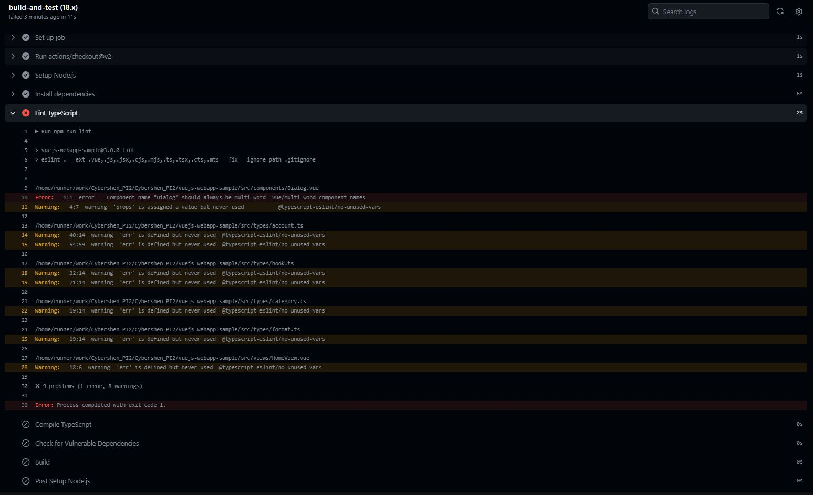

# PI2 Project

---
 

- k8s-webapp-sample: represents the project for deployment on production and pre-production environments.

- docker-webapp-sample: project used by developers to launch and test their devs locally, with all components interacting.

- go-webapp-sample: backend project in Go

- vuejs-webapp-sample: frontend project in Typescript

# Explanation of the pipelines

## vuejs-webapp-sample

### Overview

This document provides an overview of the Continuous Integration/Continuous Deployment (CI/CD) pipeline configured for our Vue.js and TypeScript application. The pipeline is designed to enforce code quality standards, security checks, and prepare the application for deployment.

### Pipeline Workflow
The pipeline, named "CI/CD Pipeline with Security Checks," is triggered on any push to the master branch or pull request against it. It runs on the latest Ubuntu runner with Node.js version 18.x.

### Steps and Criteria Tested
- Code Checkout: The repository code is checked out for use in the subsequent steps of the workflow.

- Node.js Setup: Establishes the Node.js environment, using the specified version from the matrix to ensure compatibility with our project's requirements. This step also configures caching for npm dependencies to speed up installation.

- Install Dependencies: Executes npm ci to install the exact versions of npm dependencies as specified in package-lock.json, ensuring consistent and reproducible builds.

- Lint TypeScript: Runs npm run lint to lint the TypeScript code, checking for syntax errors, enforcing code style guidelines, and identifying potential errors or anti-patterns in the code.

- Compile TypeScript: Utilizes the TypeScript compiler (tsc) to compile TypeScript code to JavaScript, ensuring there are no compilation errors.

- Vulnerable Dependencies Check: Performs npm audit --production to scan the project's dependencies for known security vulnerabilities that could be exploited in a production environment.

- Type-Check: Executes npm run type-check to perform static type-checking on the codebase, validating type correctness across the application without emitting compiled output.

- Build: Runs npm run build to create a production build of the application, confirming that the application can be successfully built without errors.

- Security and Quality Checks
The CI/CD pipeline includes several steps that focus on maintaining a high standard of code quality and security:

- Code Quality: Assessed through linting and static type-checking, ensuring adherence to coding standards and identifying potential improvements.

- Security: Checked by scanning dependencies for vulnerabilities, aiming to catch and remediate risks before they reach production.

### Testing the pipeline 

We can see that we find some issue if the typescript code :

## Note

Each application should have its own .github/workflow/XXX.yml file.

But in our case, as we have several applications in a github repo and to make the github workflow work, the .github must be at the root of the project, this is why we have to put our code here and specify paths to tell which application the pipeline applies to.